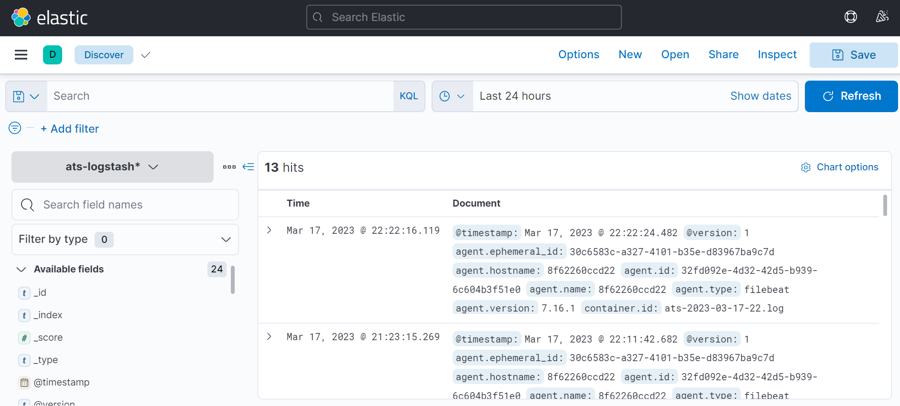
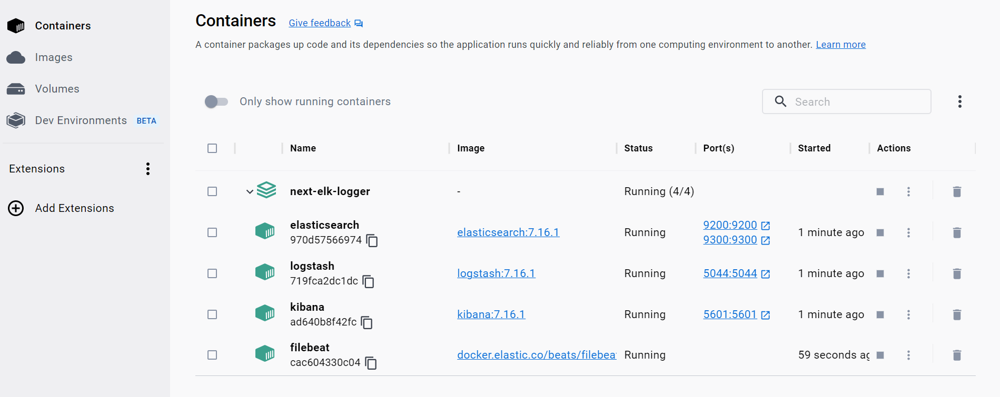

# Docker Logging with Filebeat, Elasticsearch, Logstash and Kibana



# Step-01: Project run

### Clone the repository from the following url

```bash
https://github.com/engr-lukman/next-elk-logger.git
```

### Run the following command in the terminal

```bash
npm install
# or
yarn
```

### Getting Started

First, run the development server:

```bash
npm run dev
# or
yarn dev
```

Open [http://localhost:3000](http://localhost:3000) with your browser to see the result.

# Step-02: Docker run

### Run the docker using following command in the terminal

```bash
docker compose up -d
```



Open [http://localhost:5601](http://localhost:5601) with your browser to see the kibana.

Open [http://localhost:9200](http://localhost:9200) with your browser to see the elasticsearch.

### Stop the docker using following command in the terminal

```bash
docker compose down
```

# Learn More

To learn more about ELK, take a look at the following resources:

- [Elastic Stack](https://www.elastic.co/what-is/elk-stack) - learn about Elastic Stack features and API.
- [Winston](https://github.com/winstonjs/winston/tree/2.x) - learn about winston.
- [winston-daily-rotate-file](https://www.npmjs.com/package/winston-daily-rotate-file) - learn about winston-daily-rotate-file.
